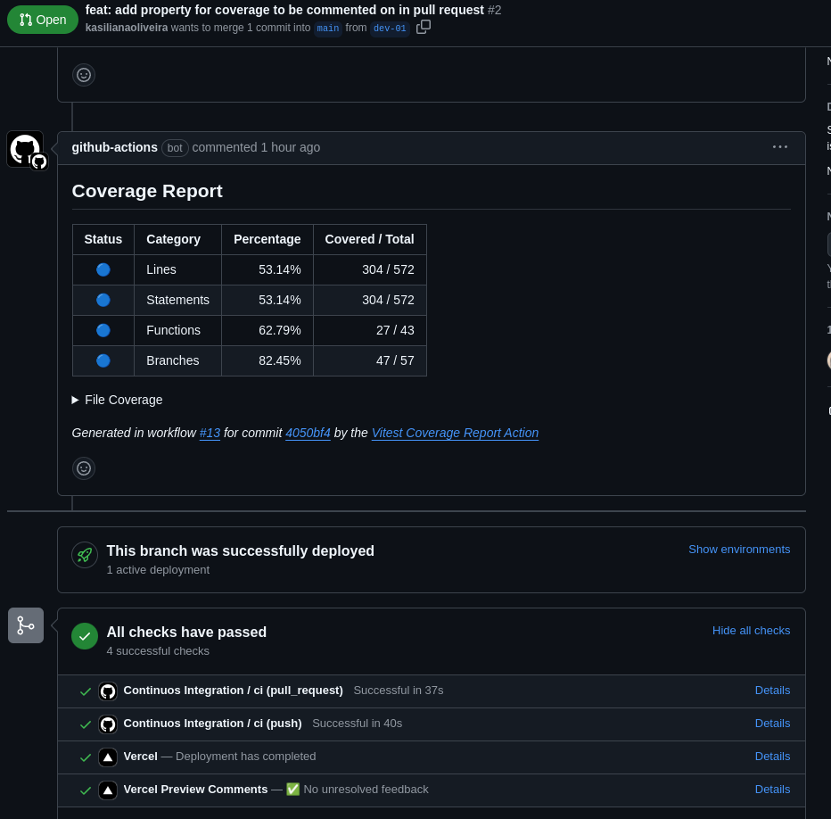
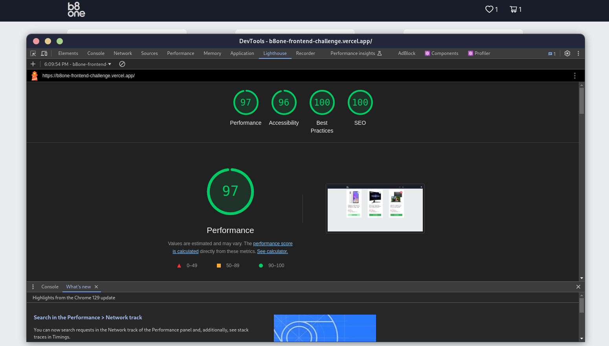
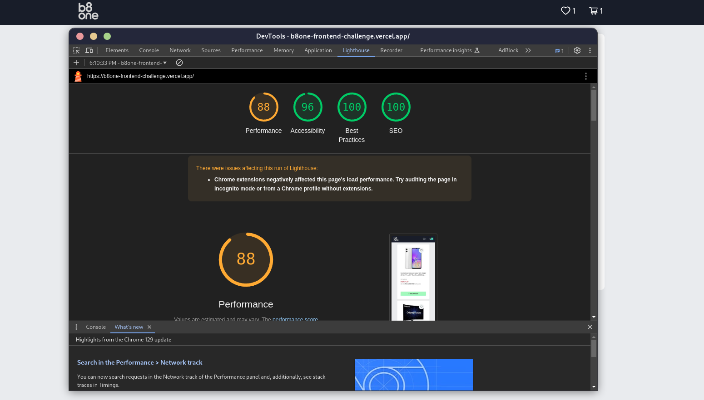

[JAVASCRIPT__BADGE]: https://img.shields.io/badge/Javascript-000?style=for-the-badge&logo=javascript
[TYPESCRIPT__BADGE]: https://img.shields.io/badge/typescript-D4FAFF?style=for-the-badge&logo=typescript
[REACT__BADGE]: https://img.shields.io/badge/React-005CFE?style=for-the-badge&logo=react
[PROJECT__BADGE]: './assets/dashboard.png'
[PROJECT__URL]: https://desafio-fullstack-seven.vercel.app

<h1 align="center" style="font-weight: bold;">Desafio frontend 💻</h1>

![react][REACT__BADGE]
![typescript][TYPESCRIPT__BADGE]
![javascript][JAVASCRIPT__BADGE]

<p align="center">
 <a href="#about">Sobre</a> • 
 <a href="#started">Começando</a> 
</p>

<p align="center">
    
</p>

<h2 id="started">📌 Sobre 📌</h2>

Este projeto foi desenvolvido como parte de um desafio técnico de frontend da B8one. Ele permite que os usuários realizem diversas ações, incluindo adicionar itens ao carrinho, adicionar produtos aos favoritos e visualizar tanto os itens do carrinho quanto os favoritos. Além disso, o projeto foi desenvolvido com foco na responsividade, garantindo uma experiência de usuário fluida e agradável em diferentes dispositivos, desde desktops até dispositivos móveis.

- [Clique aqui para acessar o site](https://b8one-frontend-challenge.vercel.app/)

### Ações que pode ser executadas
- Adicionar/Remover um produto do carrinho
- Adicionar/Remover um produto dos favoritos
- Visualizar os produtos no carrinho
- Visualizar os produtos nos favoritos
- Aumentar/Diminuir a quantidade de um item


### Adicionais
- Foram adicionados testes unitários com foco:
    - Verificar a listagem dos produtos
    - Adicionar produto do carrinho
    - Remover produto do carrinho
    - Adicionar produto dos favoritos
    - Remover produto dos favoritos

- Adicionado github action onde verifica:
    - Instalação das dependências
    - Rodar testes
    - Verificar coverage de testes
    - Comentário em pull request mostrando coverage de testes
    - Rodar o build

### Imagem de demonstração do github action

 <p align="left">
    
</p>

### Imagens da aplicação


 <p align="left">
    
</p>
 <p align="left">
    
</p>

### Teste com Lighthouse

#### O Google Lighthouse é uma ferramenta automatizada de código aberto para medir a qualidade de páginas da web. 
- Desktop
 <p align="left">
    
</p>

- Mobile

 <p align="left">
    
</p>

<h2 id="started">🚀 Começando 🚀</h2>

<h3>Pré-requisitos</h3>

Aqui você lista todos os pré-requisitos necessários para executar seu projeto.

- [NodeJS](https://github.com/)
- [Git 2](https://github.com)

<h3>Clone</h3>

Como clonar o projeto

```bash
git clone https://github.com/kasilianaoliveira/b8one-frontend-challenge
```

<h3>Comandos para rodar o projeto</h3>

Como iniciar o projeto você pode utilizar npm, yarn ou pnpm, escolha o que preferir.

```bash
cd b8one-frontend-challenge
pnpm i
pnpm dev
```

Para rodar os testes

```bash
pnpm test
```


## Tecnologias usadas

- React
- Typescript
- Vite
- Antd icons
- Zustand
- React Toast
- Vitest
- React Testing Library
