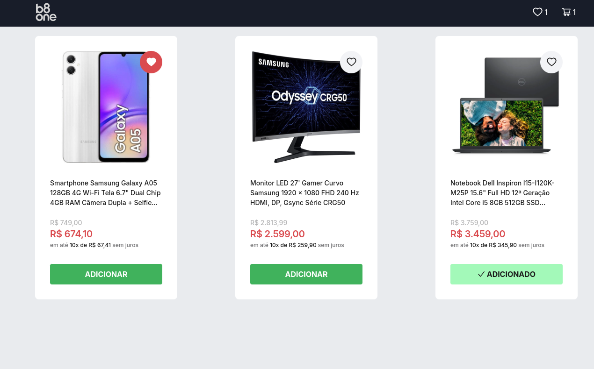
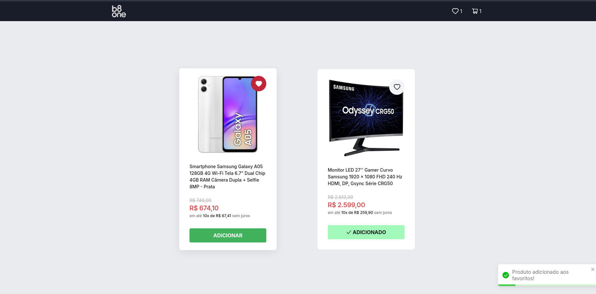
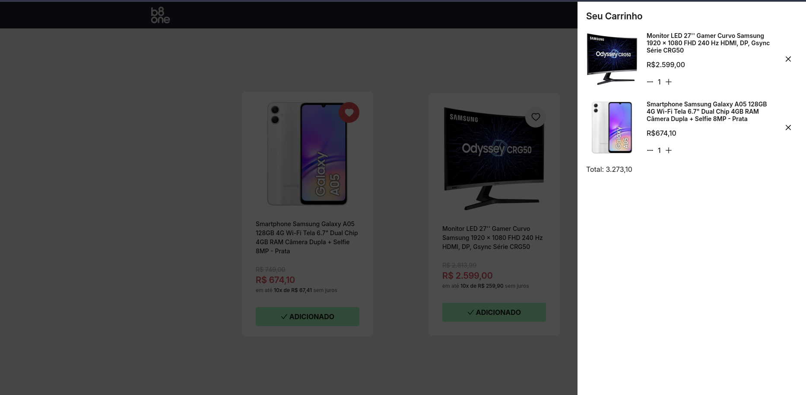

[JAVASCRIPT__BADGE]: https://img.shields.io/badge/Javascript-000?style=for-the-badge&logo=javascript
[TYPESCRIPT__BADGE]: https://img.shields.io/badge/typescript-D4FAFF?style=for-the-badge&logo=typescript
[REACT__BADGE]: https://img.shields.io/badge/React-005CFE?style=for-the-badge&logo=react
[PROJECT__BADGE]: './assets/dashboard.png'
[PROJECT__URL]: https://desafio-fullstack-seven.vercel.app

<h1 align="center" style="font-weight: bold;">Desafio frontend 💻</h1>

![react][REACT__BADGE]
![typescript][TYPESCRIPT__BADGE]
![javascript][JAVASCRIPT__BADGE]

<p align="center">
 <a href="#about">About</a> • 
 <a href="#started">Getting Started</a> 
</p>

<p align="center">
    
</p>

<h2 id="started">📌 Sobre 📌</h2>

Este projeto foi desenvolvido como parte de um desafio técnico de frontend da B8one. Ele permite que os usuários realizem diversas ações, incluindo adicionar itens ao carrinho, adicionar produtos aos favoritos e visualizar tanto os itens do carrinho quanto os favoritos. Além disso, o projeto foi desenvolvido com foco na responsividade, garantindo uma experiência de usuário fluida e agradável em diferentes dispositivos, desde desktops até dispositivos móveis.

- [Clique aqui para acessar o site](https://b8one-frontend-challenge.vercel.app/)
 <p align="center">
    
</p>
 <p align="center">
    
</p>


<h2 id="started">🚀 Getting started 🚀</h2>

<h3>Pré-requisitos</h3>

Aqui você lista todos os pré-requisitos necessários para executar seu projeto.

- [NodeJS](https://github.com/)
- [Git 2](https://github.com)

<h3>Clone</h3>

Como clonar o projeto

```bash
git clone https://github.com/kasilianaoliveira/b8one-frontend-challenge
```

<h3>Comandos para rodar o projeto</h3>

Como iniciar o projeto

```bash
cd frontend
pnpm i
pnpm dev
```

## Tecnologias usadas

- React
- Typescript
- Vite
- Antd icons
- Zustand
- React Toast
